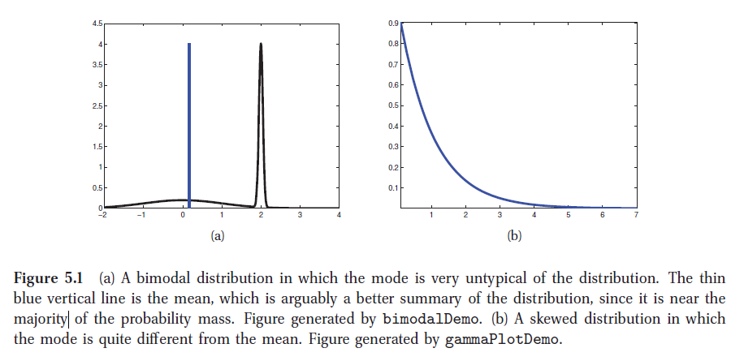

## 5.2 后验分布

​	后验概率$$\mathit{p}(\theta|\mathit{D})$$概括了我们关于位置变量$$\theta$$的估计。在这节中，我们将讨论下可以从概率分布中得到的一些特计量，比如后验概率等。这些汇总之后的统计数据往往会比原始数据更容易理解和初始化。

### 5.2.1 MAP 估计

​	我们可以很容易的通过计算均值、中值或者众数，得到一些对于未知变量的点估计。在5.7节中，我们将讨论如何通过决策理论来决定如何选择合适的方法。通常情况下，均值和中值更常用在连续变量，而边缘向量（vector of posterior marginals）则更适用于离散变量。然而，后验众数（MAP估计）是一种最常用的方法，因为它把问题简化成了优化问题，有很多高效的算法。此外，MAP估计也可以用非贝叶斯的角度来理解，把log先验概率作为正则化。

​	尽管MAP估计的计算量效率很高，但是也存在很多缺点。在本节中，我们将详细说明。

#### 5.2.1.1 不确定性

​	MAP估计（最大后验估计），以及其他的点估计（中值，均值）都存在的一个主要缺陷就是，没有提供对不确定性的估计。在很多应用场合中，了解估计的置信度是是很重要的。在5.2.2节中，我们会介绍从后验概率中得到置信度。

#### 5.2.1.2 过拟合

​	在机器学习中，相比较于解释模型参数的意义，我们更关注与预测的准确性。然而，如果我们没有考虑模型参数的不确定性，那么我们预测的分布就会过拟合。在第三章以及后面的章节中，我们会看到很多的例子。在预测中，过拟合是我们主要想要规避的问题。具体在5.7节中有详细的描述。

#### 5.2.1.3  众数是非典型点

​	选择众数最作为后验分布的描述，通常是一个较差的选择。因为众数通常对于分布来说不是很典型，不像均值或者中值。图5.1(a)以一维连续空间举例说明了这个问题。在这个例子里，众数是测量的零点，而中值或者均值则会考虑整个测量空间上的分布。在图5.1(b)的例子中，众数为0，而均值非0。这种有偏的分布，在估计方差参数是经常会出现，尤其是在层次模型中。在这些情况下，MAP估计(以及MLE最大似然估计)，显然是一个坏的估计。