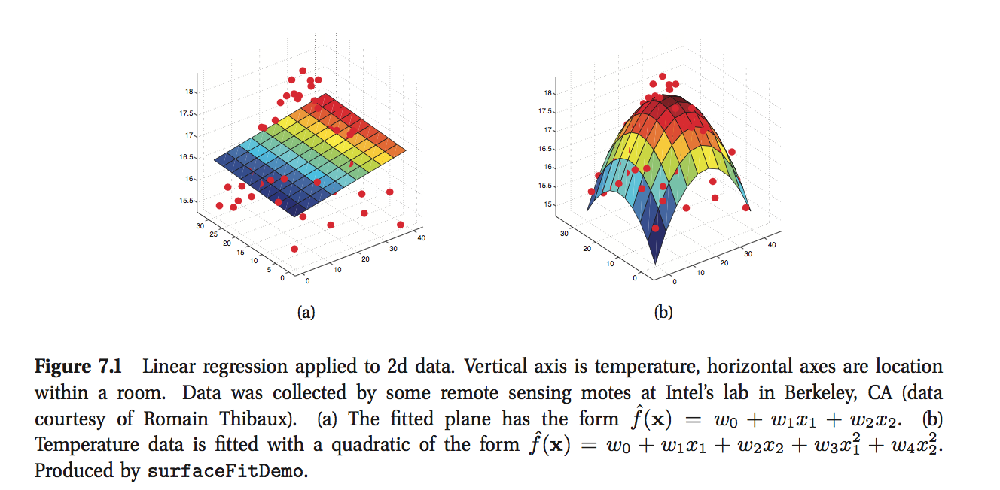

## 7.2 模型结构

正如我们在1.4.5节讲的, 线性回归模型的形式如下:

$$p(y|x, \theta) = \cal{N}(y|w^Tx, \sigma^2)$$

如果把输入$x$套用一个非线性函数, 即变成$\phi(x)$, 那么线性回归也可以对非线性关系建模, 即

$$p(y|x, \theta) = \cal{N}(y|w^T\phi(x), \sigma^2)$$

这就是所熟知的基函数扩展(basis function expansion). (注意, 此时模型仍然对$w$是线性的, 所以依旧叫做线性回归; 接下来你就会明白这点的重要性.) 一个简单的例子就是多项式基函数, 即

$$\phi(x) = [1, x, x^2, …, x^d]$$

图1.18解释了改变d值会带来的效果: 通过增加d, 我们可以生成更复杂的函数.

线性回归也适用于不止一个输入的情形. 比如, 我们想给温度随地点的变化建模. 图7.1(a)画出了$\mathbb{E}[y|x] = w_0 + w_1x_1 + w_2x_2$, 图7.1(b)画出了$\mathbb{E} = w_0 + w_1x_1 + w_2x_2 + w_3x_1^2 + w_4x_2^2$.

