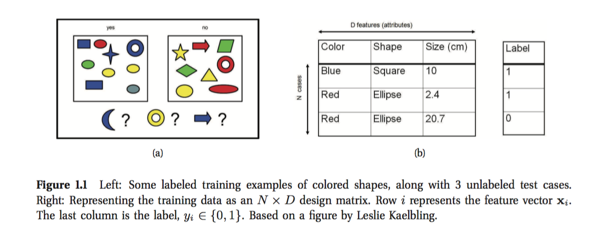

# 1 简介

## 1.1机器学习：是什么和为什么

> 我们沉入信息的海洋却匮乏知识。—John Naisbitt

​	我们正处于大数据的时代。比如：互联网有1万亿的网页；每秒钟就有1小时的视频上传到YouTube，也就是每天上传的量可以看10年；很多实验室序列化了1000个人的基因，每个基因有3.8*10^9^ 个碱基对儿；沃尔玛每天每个小时要处理1千比交易，他们的数据库里面有2.5PB的数据；如此等等。

​	这些大数据都需要自动分析的方法，**机器学习**就提供这样的方法。特别的，我们将机器学习定义为一组方法，这些方法是能够自动发现数据中模式，并且用这个模式对新数据进行预测或者是对其它一些有不确定性的问题做决策（比如如何收集更多数据）。

​	这本书采用解决这种问题的最佳方式是使用概率论的工具这种视角。概率论可以应用到任何有不确定性的问题中。对于机器学习，不确定性来源于以下几个方面：给定一些历史数据对未来的最好的预测是什么？解释一些数据最好的模型是什么？下一步应该使用什么样的评价指标？等等... 机器学习领域的概率方法跟统计学联系紧密，只不过在侧重点和术语上稍微不同。

​	我们将描述多种多样的概率模型，适用于多种多样的数据和任务。我们也会描述多种多样的算法使用这些统计模型。

 

